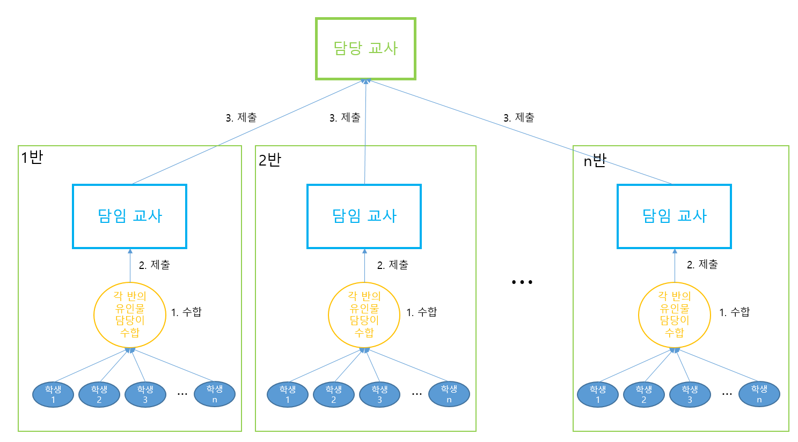
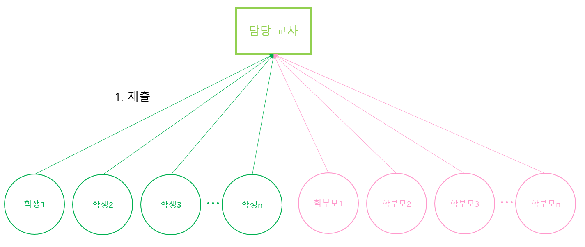
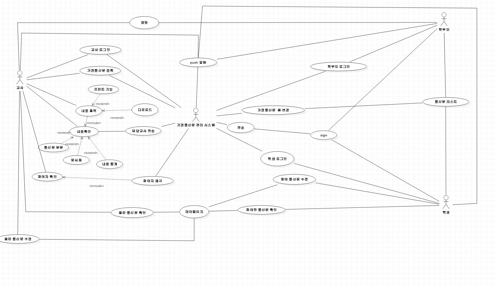
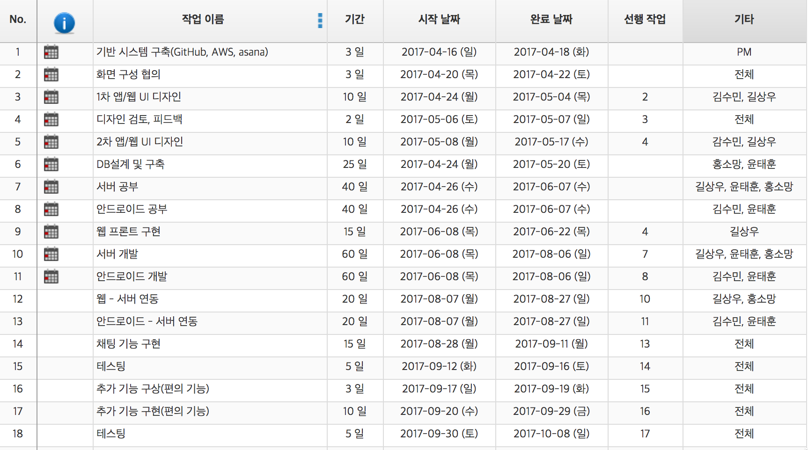
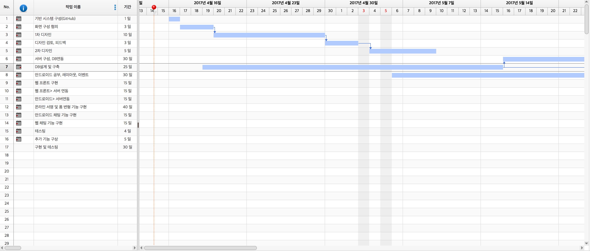
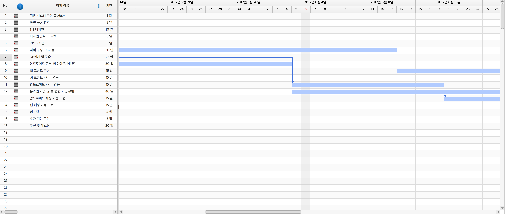
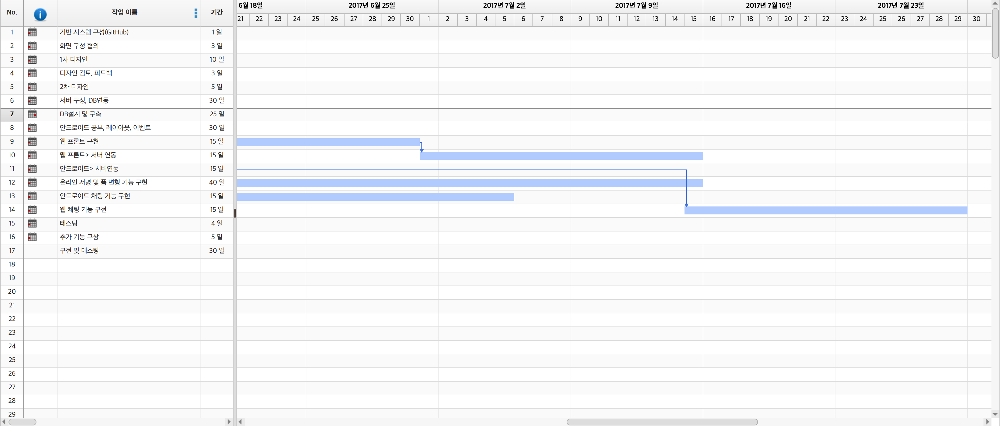
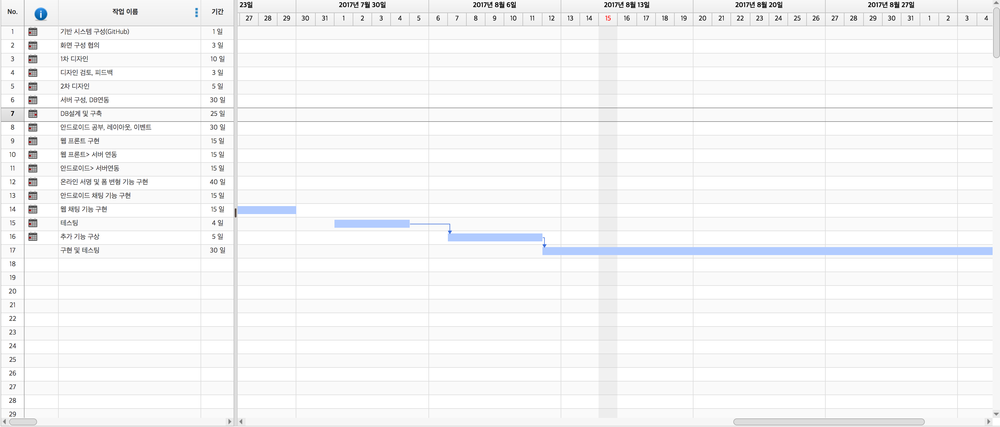
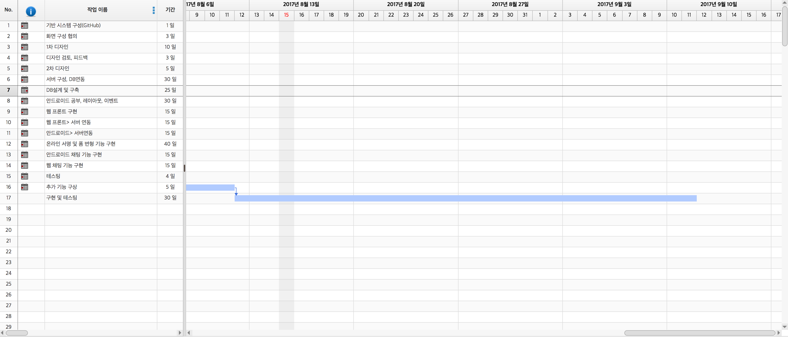

# NeeomSign Project

## 개요

### 배경
대다수의 학생들과 학부모 들 간의 학교생활 관계 문제 중 하나가 학교에서 나누어 주는 가정통신문이 학부모들에게 전달이 되지 않는 것이다. 이 문제점의 발생요인은 세 가지 정도가 있다.  
1. 학생들이 중간에서 학부모에게 까지 미 전달 또는 폐기한다.
2. 학생들이 부모님의 사인을 도용해 임의로 응답을 제출한다.
3. 학부모에게 매우 중요한 정보라도 학생들을 통해 전달이 되어야 한다.(학생이 전달하지 않으면 학부모님들께선 학교의 정보를 받아 볼 기회가 없다.)  
   실제 예시 사례로 기숙사 학교에서 지내는 본교 (대덕소프트웨어마이스터고등학교) 의 경우, 실제로 학부모에게 전달되어야 하는 학교 내의 여러 공지들, 그리고 학부모의 서명이 필요한 가정통신문, 심지어 학부모의 의견 수렴을 위해 학교에서 가정으로 보내는 가정통신문의 경우에도 학생들이 학부모님들께 알려드리지 않고, 학생들이 학부모님께 연락 후 대리 서명을 진행하거나 자신이 자신의 주관으로 판단하여 대리 서명을 진행하는 경우다 대다수 이며, 또한 많은 학생들이 학부모님들께 이러한 정보나 통신문 내용들을 전달하지 않아 나중에서야 정보 전달이 되는 경우가 흔하게 일어나는 현상이 발생하며, 또한 학교는 학생들을 통해서 학부모님들께 급식 정보, 학사 일정 등의 학교 공지들을 전달하는 시스템 체계를 이용하고 있기에, 중간에서 여러 정보들이 전달되지 못하는 상황이 일어나고 있으며, 많은 사람들이 이에 불편함을 가지고 있다. 이러한 문제점들의 해결 방안을 모색 하던 중, 조 원 중 한명이 학교와 가정을 연결한 애플리케이션, 즉, 학생, 학부모, 교사, 학교를 하나의 애플리케이션의 사용자로 만들어 각종 정보를 전달하는 등의 간단한 기능을 구현해보자는 아이디어로 시작하여 이후 브레인스토밍을 통해 각종 학교에서 학부모, 학생에게 제공하는 정보나 현장체험학습, 급식 신청 등의 학부모와 학생 동의를 구해야 하는 것들을 학교에서 등록할 시 알려주고, 각 정보 전송, 각종 신청서 동의 여부 조사 및 이후 의견 수렴 및 전송 등의 기능을 가진 프로그램 개발을 현재 계획 및 조원들과 토의 후 애플리케이션과 웹 버전으로 나누어 개발을 계획 및 진행 중이다.

### 서비스 개념
대리 사인, 종이 낭비, 가정통신문 분실 등과 같은 많은 문제점이 발생하기 때문에 학생과 학부모는 교사가 가정통신문을 올렸을 때 직접 사인을 할 수 있는 기능, 가정통신문을 분류할 수 기능,  가정 통신문을 참여 했는지 체크하는 기능, push알림 기능을 이용하여 애플리케이션이나 웹을 통해 빠르고 손쉽게 가정통신문들을 볼 수 있고, 온라인상에서 직접 사인, 신청서 작성, 설문지 작성 등을 하여 문서화, 통계, 통신문 분류를 통해 교사한테 전송되어 보기 쉽게 확인 할 수 있다.

### 주요 타겟 고객
1. 현재 학교에 재학 중인 학생들  
   학생들은 이 애플리케이션이 제공하는 서비스 중 학부모와 같은 기능을 하는 서비스 들을 사용하게 될 것이다. 학생들은 학교에서 여러 신청서나 가정통신문들을 업로드 하면 알림을 받고, 그 알림을 통해 해당 신청서나 가정통신문에 들어가서 확인 및 동의를 할 수 있고, 만약 학부모 사인 및 학부모 선택 사항이 필요한 경우에도 자신에게 접근 권한이 있는 부분만 체크가 가능하고, 전송하면, 학부모 측에서도 이와 같은 방법으로 서명 및 의견을 전송 할 수 있다. 또한 학교에서 급식식단표와 일반 가정통신문 등과 같은 공지사항 등을 파일로 올리면 그것 또한 확인 및 다운로드가 가능하다.  
2. 재학생들의 각각의 학부모님들  
   학부모 고객 또한 학생 고객처럼 이 애플리케이션에서 학교에서 업로드 한 파일 및 공지사항에 대한 알림을 받을 수 있으며, 해당란에 정보 확인 및 사인이 가능하다. 이 서비스를 통해 좀 더 쉽고 간편하게 신청 및 의견 수렴이 가능하며, 중간에 통신문 분실, 미 전달 등의 문제가 발생하지 않아 좀 더 안전하고 좀 더 간편하게 신청 및 조사 참여가 가능하다. 또한 각각 학부모와 학생들은 자신의 마이페이지가 존재해 자신이 신청 및 전송해야 하는 통신문들의 현재 전송 여부 및 기간을 보여주며, 신청기간이 끝난 것은 자동 삭제 및 정리가 가능하며, 지정된 기간 동안은 제출 마감 시간 전까지 수정이 가능하다.  
3. 각 학교의 교사  
   담당 교사로는 각 담임 교사, 가정통신문 최종 담당자 등 여러 분야의 교사가 존재하는데 각각 담당 교사는 서비스에 가정통신문, 공지, 신청서등 학교에서 가정에 보내야 하는 것들이나 학부모나 학생의 동의 및 의견 수렴이 필요한 것들을 서비스에 업로드 시킨다.  
   이후 학부모와 학생이 해당 문서에 서명 및 의견 수렴이 끝난 파일을 전송하면 서비스 내에서 통계 및 반별로 정리를 통해 담당 교사에게 파일로 바로 전송이 되고, 필요에 따라 파일을 함축적으로 문서화를 시켜준다.  
   담당 교사는 해당 문서에 있는 사인도 확인 할 수 있으며, 이후 원하는 파일 출력이 가능하다.  
   그 덕에 일일이 손으로 입력 및 통계를 해야 하는 매우 단순하고 불필요한 작업을 줄일 수 있다.  
   또한 반별로 정리하여 해당 담당 교사에게 보내고, 담당 교사는 그 파일을 받아 통계 및 정리, 최종 출력 및 전송까지 해야 하는 많은 동작 들이 필요한데 이 애플리케이션을 이용하여 그 작업들을 한 번에 하고, 한 번에 정리하여, 사용자를 좀 더 편하고 많은 일들을 간단하게 정리 할 수 있도록 도와준다.  
   **기존 방식**  
   
   **NeeomSign 방식**  
   
   또, 학교의 각종 유인물을 온라인상으로 규격화시킴으로서 부모님께서 어플리케이션을 통해 확실히 전달받으실 수 있도록 하고, 담당자 측에서도 신청 의사, 설문 내용을 온라인상으로 받아들여 자동으로 문서화시킬 수 있기 때문에 아날로그 방식으로 유인물을 수합해 Excel문서를 작성했던 기존의 방식보다 접근성, 유인물 수합 속도 면에서 좋은 효과를 낼 수 있다.  

### 주요 서비스 내용

1. 주요 서비스 기능
   - 학생, 학부모 - 가정통신문 응답 제출 기능(Web, App)
   - 학생, 학부모 - 마이페이지를 통해 응답한/응답하지않은 가정통신문에 대한 정보 확인
   - 학생, 학부모 - 가정 통신문을 간략화해 보여주는 폼 기능
   - 학생, 학부모 - 가정통신문 응답 내용 수정 기능
   - 교사 - 가정통신문 등록 기능
   - 교사 - 가정통신문 응답 내용을 교사가 학년별, 반별, 통신문 종류별 분류되어 받을 수 있는 기능
   - 교사 - 가정통신문 응답 내용을 문서화시켜 받을 수 있도록 하는 기능(Excel)
   - 교사 - 가정통신문 응답 내용을 을 통계화 해주는 기능(Excel)
   - 교사 - 가공을 마친 가정통신문 응답 내용을 인쇄/다운로드 할 수 있는 기능
   - 교사 - 마이페이지를 통해 등록된 가정통신문 상태를 체크하는 기능
   - 교사 - 가정통신문 수정 기능
   - 교사 - 가정통신문 응답 현황 체크 기능
   - 학부모, 교사 - 학부모, 교사 간 채팅기능
   - 시스템 - push알림 기능
2. 서비스 시나리오

**Usecase 다이어그램**

**usecase 명세서**  

**학생**  
  
**유스케이스명 : 학생 회원가입**  
액터명 : 학생  
보조액터 : 시스템  
유스케이스 개요 : 학생이 학교에서 발급받은 시리얼 번호를 이용해 회원가입을 하는 유스케이스이다.  
**정상흐름**  
➀ 어플리케이션을 실행한다. (학생)  
➁ 회원가입 버튼을 누른다. (학생)  
➂ 회원가입 창으로 전환된다. (시스템)  
➃ 시리얼 번호를 입력한다. (학생)  
➄ 입력받은 시리얼 번호를 이용해 신원을 확인한다. (시스템)  
➅ 사용할 아이디와 패스워드를 정한다. (학생)  
➆ 개인정보 제공 동의서를 읽고 동의한다. (학생)  
➇ 회원가입을 완료한다.  
**예외**  
➀ 정상흐름의 ➃에서 유효하지 않은 시리얼 번호가 입력되었을 경우 절차를 진행하지 않고 “유효하지 않은 시리얼 번호입니다.”라는 문구를 출력한다.  
➁ 정상흐름의 ➅에서 입력한 아이디가 이미 존재하는 아이디일 경우 절차를 진행하지 않고 “이미 존재하는 아이디입니다.”라는 문구를 출력한다.  
➂ 정상흐름의 ➆에서 개인정보 제공 동의서에 동의하지 않는 경우 회원가입을 불허하고 “개인정보 제공 동의서에 동의하셔야 회원가입이 가능합니다.”라는 문구를 출력한다.  
  
  
**유스케이스명 : 학생 로그인**  
액터명 : 학생  
보조액터 : 시스템  
유스케이스 개요 : 학생이 어플리케이션에 접속해 로그인하는 유스케이스이다.  
사전 조건 : 회원가입을 마친 상태여야 한다.  
**정상 흐름**  
➀ 어플리케이션을 실행한다. (학생)  
➁ 아이디와 패스워드를 입력한다. (학생)  
➂ 입력받은 아이디와 패스워드를 검사해 접속을 승인한다. (시스템)  
**예외**  
➀ 정상흐름의 ➂에서 유요하지 않은 아이디나 패스워드가 입력되었을 경우 접속을 불허하고 “잘못된 ID/PW를 입력하셨습니다.”라는 문구를 출력한다.  
➁ 예외 ➀이 5회 연속 반복될 경우 관리자에게 문의하는 페이지로 이동한다.  
  
  
**유스케이스명 : 학생 가정통신문 응답**  
액터명 : 학생  
보조액터 : 시스템  
유스케이스 개요 : 학생 관점에서 가정통신문에 접근하고, 응답을 제출하는 유스케이스이다.  
사전 조건 : 신원 파악이 된 상태에서 회원가입을 거쳐 로그인을 한 상태여야 한다. 또한, 개인정보 제공 동의서에 동의를 한 상태여야 한다.  
**정상흐름**  
➀ 발신 된 푸시알림을 확인한다. (학생)  
➁ 어플리케이션에 접속한다. (학생)  
➂ 현재 가정통신문 리스트를 받아온다. (시스템)  
➃ 가정통신문을 열람한다. (학생)  
➄ 가정통신문에 응답하고 제출한다. (학생)  
➅ 시스템은 응답을 검토해 담당교사에게 전송한다. (시스템)  
**선택흐름**  
➀ 마이페이지에 들어간다. (학생)  
➁ 참여한 가정통신문과 미 참여 가정통신문을 조회한다. (학생)  
➂ 시스템은 참여한 가정통신문과 참여하지 않은 가정통신문을 각각 화면에 보여준다. (시스템)  
➃ 가정통신문을 선택하면 정상흐름의 ➁를 수행한다. (학생, 시스템).  
**예외**  
➀ 정상흐름의 ➁에서 선택한 가정통신문이 이미 참여한 가정통신문일 경우 응답을 수정해 다시 제출할 수 있도록 한다.  
➁ 정상흐름의 ➁에서 선택한 가정통신문의 제출 기한이 끝난 경우에는 제출 및 수정이 불가능하도록 한다.  
  
  
**학부모**
  
**유스케이스명 : 학부모 회원가입**  
액터명 : 학부모  
보조액터 : 시스템  
유스케이스 개요 : 학부모가 학교에서 발급받은 시리얼 번호를 이용해 회원가입을 하는 유스케이스이다.  
**정상 흐름**  
➀ 어플리케이션을 실행한다. (학부모)  
➁ 회원가입 버튼을 누른다. (학부모)  
➂ 회원가입 창으로 전환된다. (시스템)  
➃ 시리얼 번호를 입력한다. (학부모)  
➄ 입력받은 시리얼 번호를 이용해 신원을 확인한다. (시스템)  
➅ 사용할 아이디와 패스워드를 정한다. (학부모)  
➆ 개인정보 제공 동의서를 읽고 동의한다. (학부모)  
➇ 회원가입을 완료한다.  
**예외**  
➀ 정상흐름의 ➃에서 유효하지 않은 시리얼 키가 입력되었을 경우 절차를 진행하지 않고 “유효하지 않은 시리얼 키입니다.”라는 문구를 출력한다.  
➁ 정상흐름의 ➅에서 입력한 아이디가 이미 존재하는 아이디일 경우 절차를 진행하지 않고 “이미 존재하는 아이디입니다.”라는 문구를 출력한다.  
➂ 정상흐름의 ➆에서 개인정보 제공 동의서에 동의하지 않는 경우 회원가입을 불허하고 “개인정보 제공 동의서에 동의하셔야 회원가입이 가능합니다.”라는 문구를 출력한다.  
  
  
**유스케이스명 : 학부모 로그인**  
액터명 : 학부모  
보조액터 : 시스템  
유스케이스 개요 : 학부모가 어플리케이션에 접속해 로그인하는 유스케이스이다.  
사전 조건 : 회원가입을 마친 상태여야 한다.  
**정상 흐름**  
➀ 어플리케이션을 실행한다. (학생)  
➁ 아이디와 패스워드를 입력한다. (학생)  
➂ 입력받은 아이디와 패스워드를 검사해 접속을 승인한다. (시스템)  
**예외**  
➀ 정상 흐름의 ➂에서 유요하지 않은 아이디나 패스워드가 입력되었을 경우 접속을 불허하고 “잘못된 ID/PW를 입력하셨습니다.”라는 문구를 출력한다.  
➁ 예외 ➀이 5회 연속 반복될 경우 관리자에게 문의하는 페이지로 이동한다.  
  
  
**유스케이스명 : 학부모 가정통신문 응답**  
액터명 : 학부모  
보조액터 : 시스템  
유스케이스 개요 : 학부모 관점에서 가정통신문에 접근 및 응답을 제출하고 담당 교사와 질의응답을 하는 유스케이스이다.  
사전 조건 : 신원 파악이 된 상태에서 회원가입을 거쳐 로그인을 한 상태여야 한다. 또한, 개인정보 제공 동의서에 동의를 한 상태여야 한다.  
**정상 흐름**  
➀ 발신 된 푸시알림을 확인한다. (학부모)  
➁ 어플리케이션에 접속한다. (학부모)  
➂ 현재 가정통신문 리스트를 받아온다. (시스템)  
➃ 가정통신문을 열람한다. (학부모)  
➄ 가정통신문에 응답하고 제출한다. (학부모)  
➅ 시스템은 응답을 검토해 담당교사에게 전송한다. (시스템)  
**선택 흐름**  
➀ 마이페이지에 들어간다. (학부모)  
➁ 참여한 가정통신문과 미 참여 가정통신문을 조회한다. (학부모)  
➂ 시스템은 참여한 가정통신문과 참여하지 않은 가정통신문을 각각 화면에 보여준다. (시스템)  
➃ 가정통신문을 선택하면 정상흐름의 ➁를 수행한다. (학부모, 시스템).  
**예외**  
➁ 정상 흐름의 ➁에서 선택한 가정통신문이 이미 참여한 가정통신문일 경우 응답을 수정해 다시 제출할 수 있도록 한다.  
➂ 정상 흐름의 ➁에서 선택한 가정통신문의 제출 기한이 끝난 경우에는 제출 및 수정이 불가능하도록 한다.  
  
  
**유스케이스명 : 학부모-교사 채팅**  
액터명 : 학부모  
보조액터 : 시스템  
유스케이스 개요 : 학부모 관점에서 가정통신문 수합 담당 교사와 채팅하는 유스케이스이다.  
사전 조건 : 로그인이 된 상태여야 한다.  
**정상 흐름**  
➀ 가정통신문을 선택한다. (학부모)  
➁ 교사와 채팅하기 버튼을 누른다. (학부모)  
➂ 상담하기 버튼을 누른다. (학부모)  
➃ 채팅할 수 있는 화면으로 전환되고 연결이 성립된다. (시스템)  
➄ 채팅한다. (학부모)  
  
  
**교사**  
  
**유스케이스명 : 가정통신문 등록**  
액터명 : 교사  
보조 액터명 : 시스템  
유스케이스 개요 : 교사가 가정통신문 문서를 등록할 수 있는 것이다.  
사전 조건 : 교사로 로그인되어야 하고 등록할 가정통신문이 있어야 한다.  
**정상 흐름**  
➀ 가정통신문을 등록한다.  
➁ 가정통신문을 폼 형태로 변형한다.  
➂ 가정통신문을 가정통신문 변경 시스템에 전송한다.  
  
  
**유스케이스명 : 내용 확인**  
액터명 : 교사  
보조 액터명 : 시스템  
유스케이스 개요 : 교사가 가정통신문들을 분류하고 문서화하며 통계를 하는 것이다.  
사전 조건 : 교사로 로그인되어야 하고 참여한 가정통신문들을 가정통신문 관리 시스템에서 받을 수 있어야 한다.  
**정상흐름**  
➀ 가정통신문이 담당교사에게 전송된다.  
➁ 가정통신문을 내용을 확인한다.  
**선택흐름**  
문서화를 선택한 경우 : 가정통신문을 문서화한다.  
내용 통계를 선택한 경우 : 가정통신문을 내용을 통계한다.  
통신문 분류를 선택한 경우 : 가정통신문을 분류한다.  
내용을 출력하고 싶은 경우 : 내용 출력 유스케이스로 이동한다.  
  
  
**유스케이스명 : 내용출력**  
액터명 : 교사  
보조 액터명 : 시스템  
유스케이스 개요 : 교사가 가정통신문 관리 시스템에 올라와 있는 가정통신문을 출력한다.  
사전 조건 : 교사로 로그인되어야 하고 가정통신문 관리 시스템에 가정통신문이 있어야 하며, 내용확인 유스케이스에서 내용출력 유스케이스를 선택해야 한다.  
**정상흐름**  
➀ 내용확인 유스케이스에서 받은 가정통신문을 받는다.  
➁ 내용을 출력한다.  
**예외흐름**
프린트 기능을 선택한 경우 : 프린트한다.  
다운로드 기능을 선택한 경우 : 다운로드한다.  
  
  
**유스케이스명 : 채팅**  
액터명 : 교사, 학부모  
보조 액터명 : 시스템  
유스케이스 개요 : 교사가 학부모와 채팅한다.  
사전 조건 : 교사로 로그인되어야 하고 학부모가 가정통신문 관리 시스템에 등록되어 있어야 한다.  
**정상흐름**  
➀ 보낼 학부모를 정한다.  
➁ 채팅을 한다.  
**예외흐름**  
학부모가 가정통신문 관리 시스템에 등록되지 않은 경우 : 등록되지 않거나 없는 학부모라는 메시지를 띄운다.  
  
  
**유스케이스명 : 참여자 확인**  
액터명 : 교사  
유스케이스 개요 : 교사가 참여한 유저(학부모,학생)을 확인한다.  
사전 조건 : 교사로 로그인되어야 하고 참여한 유저정보를 가정통신문 관리 시스템에게 받아야한다.  
**정상흐름**  
➀ 가정통신문을 선택한다.  
➁ 참여자를 확인한다.  
  
  
**유스케이스명 : 올린 통신문 확인**  
액터명 : 교사  
보조 액터명 : 시스템  
유스케이스 개요 : 교사가 유저(학생,학부모)가 올린 통신문들을 확인한다.  
사전 조건 : 교사로 로그인되어야 하고 유저(학생,학부모)가 가정통신문 관리 시스템에 올린 것을 받아야 한다.  
**정상 흐름**  
➀ 올린 통신문을 확인한다.  
**선택 흐름**  
올린 통신문에 수정을 해야할 경우 : 올린 통신문 수정 유스케이스로 이동한다.  
  
  
**유스케이스명 : 올린 통신문 수정**  
액터명 : 교사  
보조 액터명 : 시스템  
유스케이스 개요 : 교사가 유저(학생,학부모)가 올린 통신문들을 수정한다.  
사전 조건 : 교사로 로그인되어야 하고 유저(학생,학부모)가 가정통신문 관리 시스템에 올린 것을 받아야 한다.  
**정상 흐름**  
➀ 올린 통신문을 확인한다.  
② 올린 통신문을 수정한다.  
③ 수정한 통신문을 다시 가정통신문 관리 시스템에 전송한다.  

## 경쟁력/차별화

### 경쟁(유사) 서비스 현황

**유사 서비스 현황**

1. 스쿨맘 - 국민 가정통신문 앱  
스쿨맘이라는 애플리케이션을 검색 해보면 실제 학생들이 개발한 애플리케이션이라는 설명과 함께 이 애플리케이션의 주요 기능들이 설명 되어있다.  
조사 결과 가정통신문 등만 받아서 확인이 가능하고, 교육기관에서 제공하는 다양한 분야별 교육소식 또한 사용자에게 제공해 준다.  
또한 교육기관에서 제공해준 이 정보는 타 서비스(카카오톡, 라인 등)를 통해 공유가 가능하게 제작이 되었다.  
하지만 학부모/학생의 응답이 필요한 가정통신문에 대한 응답을 온라인상에서 진행할 수 있는 기능은 갖추고 있지 않다.  
현재 평점은 4.5점이지만 학교의 가정통신문 시스템과 연계가 잘 이루어지지 않고 있어 좋지 않은 평가를 받고 있다. 또한 각종 오류가 발생하고 있다.  
  
  

2. 아이엠스쿨 - 한국 1위 알림장  
이 애플리케이션은 현재 정부 3.0과 카이스트 등 여러 공공기관과 연동하여 상용화 되고 있는 애플리케이션 중 하나이다.  
이 애플리케이션은 전국 모든 학교의 소식과 자녀의 학급 소식 까지 모두 알 수 있으며, 자녀를 위한 맞춤 정보를 학부모에게 제공해주기도 한다.  
또한 자녀의 어머님들을 위한 3분 매거진 이라는 이름을 가진 기능도 제공해준다.  
3분 매거진은 어머님들을 위한 수많은 교육 정보, 행사 정보 등 여러 정보들을 어머님들께 제공해준다.  
또한 마지막으로는 애플리케이션 사용자를 위한 여러 기관 교육 혜택 등을 추가로 제공해주기도 한다.  
이 애플리케이션의 특이점은 전국에 있는 모든 학교에 대한 정보를 알 수 있고, 제공 받을 수 있으며, 학교를 즐겨찾기를 통해 저장 할 수 있다는 점과, 다양한 곳에서 학부모와 학생들에게 제공할 수 있는 여러 대회나 행사 등을 광고 형식의 팝업창으로 띄워준다는 것이다.  
그러나 이 애플리케이션의 한계점은 우선 애플리케이션의 전체적인 분위기가 초등학생, 더 나아가 중학생을 위한 서비스라는 것이다.  
고등학생부터는 제공되는 정보나 행사, 대회 등의 내용이 적합하지도 않을뿐더러, 대상이 초등학생 이다 보니 고등학생의 학부모가 이용하기에는 조금 어려운 부분이 있다는 것이다.  
또한 학부모/학생의 응답이 필요한 가정통신문에 대한 응답을 온라인상에서 진행할 수 있는 기능은 갖추고 있지 않다.  
현재 평점은 4.2점, 다운로드 수가 약 300만으로 많은 학부모님들께서 사용하고 계시고 여러 기능을 담고 있는 것은 사실이나 과도한 수익성 추구로 인한 잦은 마케팅 광고 때문에 좋지 않은 평가를 받고 있다.  
또한 가정통신문을 직접적으로 열람할 수 없고 오로지 초등학교 시절 공책에 작성하던 ‘알림장’에 대한 내용만 받아볼 수 있다는 점에서 **NeeomSign** 서비스와는 다르다고 할 수 있다.  

**기존 시장 규모 및 확장 가능성**  

위의 유사 애플리케이션의 가장 큰 문제점들은 한글뷰어, UI/UX디자인, 다양하지 못한 사용 가능 층과 광고였다.  
**NeeomSign Service 애플리케이션**은 각 학교별로 서비스가 제공되며, 초기 애플리케이션 시작 시 애플리케이션의 전반적인 사용 방법을 투토리얼 형식으로 제공할 예정이다.  
또한 사용자가 가정통신문을 받고 확인하는 데에서 그치지 않고, 제출까지 이어지는 주기능이 있기 때문에 사용자들이 좀 더 편하고 간편하게 정보를 얻을 수 있을 것이다.  
좀 더 간편하게 서로에게 정보 제공 및 수집하는 것이 주 개발 목적이기 때문에, 기존 시장에 있는 다른 애플리케이션에 대해 충분히 경쟁력을 가지고 있다고 할 수 있다.  

### 경쟁(유사) 서비스 대비 차별화 요소

- 스쿨맘 애플리케이션 평가 댓글에서 가정통신문이 작아 잘 안보이기 때문에 확대 기능을 추가를 원하는 것을 볼 수 있다. **NeeomSign 애플리케이션**은 가정통신문을 간단하게 보기 위해 원래 가정통신문 파일을 간단한 폼으로 변형하여 보여줘 사용자가 쓰기에 편하게 만들어 준다.
- 지금까지 나온 애플리케이션의 경우 가정통신문을 보여주기만 했지만, **NeeomSign 애플리케이션**은 직접 온라인상에서 사인하여 담당교사에게 전송할 수 있다.
- 아이엠스쿨 애플리케이션은 알림장기능이 주 기능이라 중학교나 고등학교에 쓰기는 적합하지 않지만, **NeeomSign 애플리케이션**은 주 기능이 가정통신문 사인기능이기 때문에 초, 중, 고 어디서든 쓰기 적합하다.
- 애플리케이션 첫 실행 시 사용 방법에 대한 튜토리얼이 진행된다.
- 아이엠스쿨 애플리케이션에서 광고 때문에 push알람이 계속 떠서 불편하다는 평가가 많았지만, **NeeomSign 애플리케이션**은 수익 목적으로 광고를 넣지 않고, 만약 광고가 있을 때는 push 알림 끄기 기능으로 광고를 push 알림으로 받지 않을 수 있도록 한다.
- **NeeomSign 애플리케이션**은 교사와 학부모를 이어 줄 수 있는 채팅 기능으로 교사의 전화번호를 알지 못하거나 직접 전화하기 불편한 학부모님들은 쉽게 교사와 연락하고 질의응답할 수 있다. 

## 개발 계획

### 개발 팀 구성

이름 | 역할
—--|---
길상우 | html, css, 서버 개발(Spring Framework), UI/UX설계(디자인)
김수민 | Android, UI/UX설계(디자인)
윤태훈 | Android, DB설계, 전반적인 모든 개발에 참여(Sub)
홍소망 | 서버 개발(Spring Framework), DB설계
  
### 프로젝트 수행 방법

**간트 차트**  

예상 시작일 : 2017.04.16.  

예상 종료일 : 2017.09.11.  

1. 표

2. 간트 그래프

