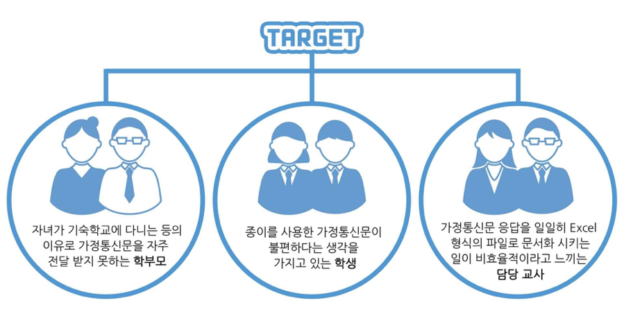
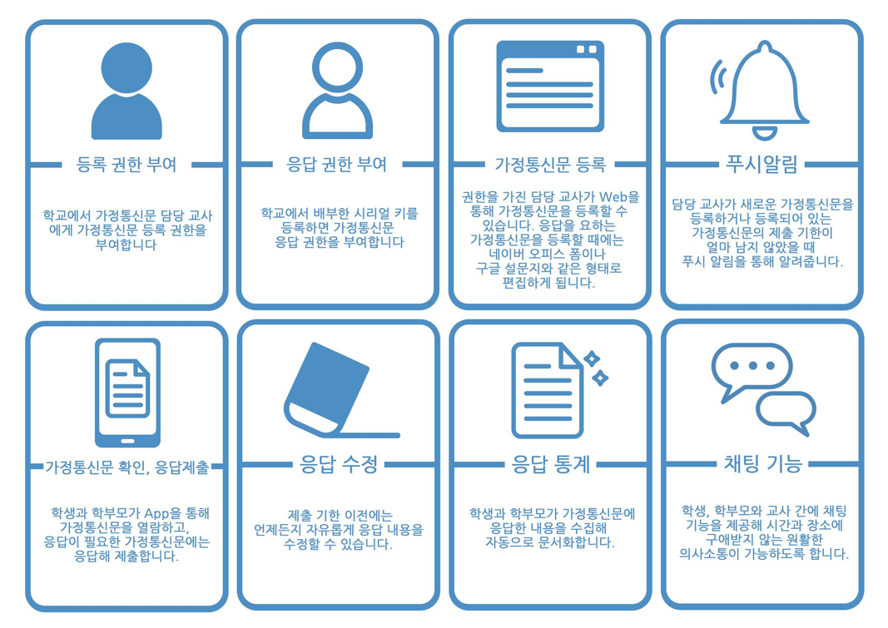
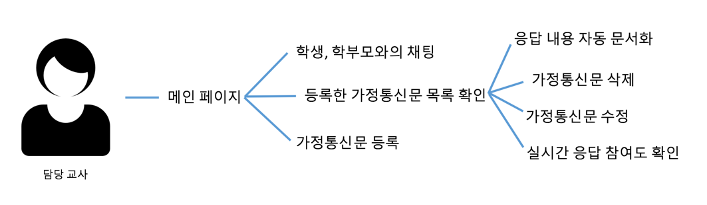
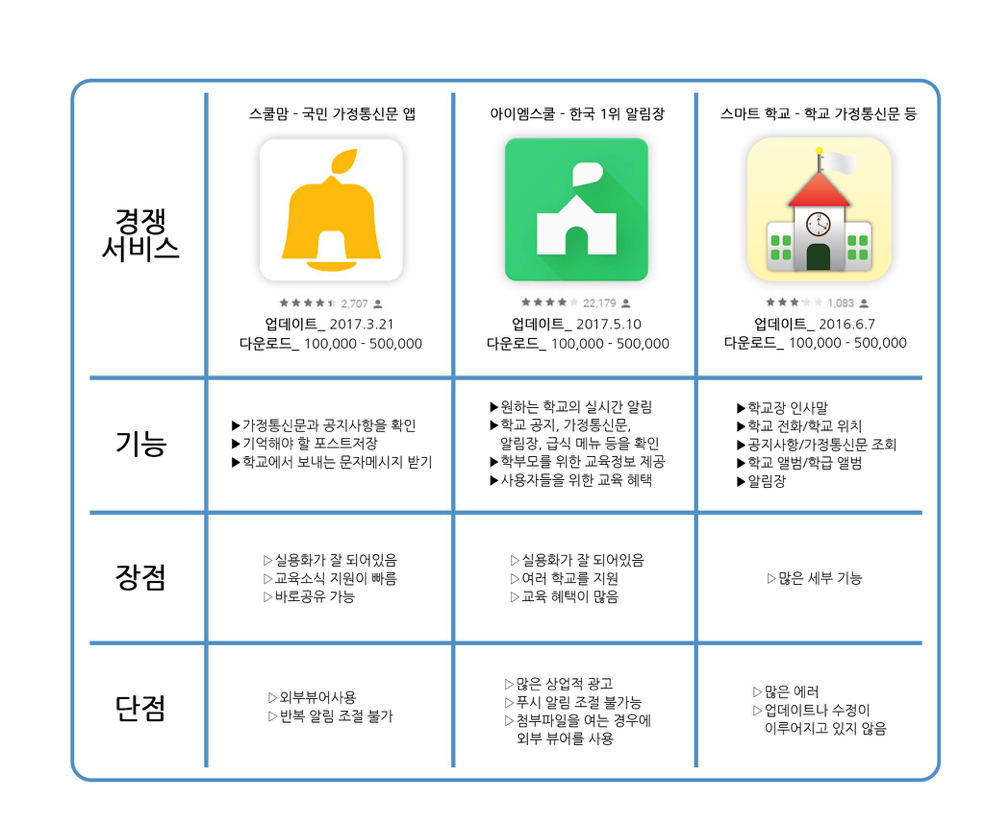
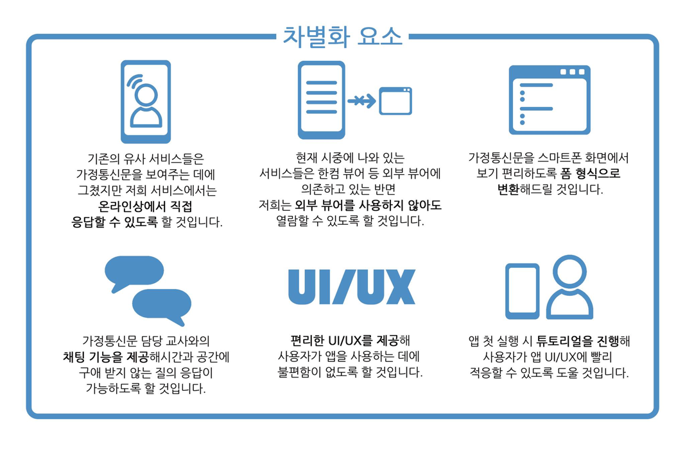

# SignMe - 디지털 가정통신문 솔루션

## SignMe 프로젝트란?

SignMe 프로젝트는 기존의 가정통신문 체계의 불편함을 해소하고자 고안한 프로젝트로서 가정통신문의 전달이 잘 이루어 지지 않는 문제, 학생의 학부모 서명 도용, 엄청난 양의 종이 소비, 복잡한 절차를 거쳐야 하는 가정통신문 수합, 그리고 학생, 학부모와 담당 교사 간 커뮤니케이션 부재 등의 문제점들을 해결할 수 있는 솔루션입니다.  
  
가정통신문 수합에 4단계의 절차가 필요했던 기존의 아날로그 방식 가정통신문 체계를 디지털화 시킴으로써 단 한 번의 절차 만으로 가정통신문 수합이 가능해지는것이 저희 서비스의 가장 큰 특징입니다.  

## 타겟 고객

## 주요 서비스 내용

### 주요 서비스 기능  
  
### 서비스 시나리오  
1. 학생, 학부모  
  
2. 교사  
  

## 서비스 경쟁력/차별화

### 경쟁 서비스 현황  
  

### 경쟁 서비스 대비 차별화 요소  
  

## 개발 계획

### 개발 팀 구성

이름 | 학교명 | 학년 | 역할 | 공모전 수상 이력
---|---|---|---|---
길상우 | 대덕소프트웨어마이스터고등학교 | 2학년 | 웹, 서버 | 제 12회 Appjam 장려상
김수민 | 대덕소프트웨어마이스터고등학교 | 2학년 | 안드로이드 | X
윤태훈 | 대덕소프트웨어마이스터고등학교 | 2학년 | 기획, PM, PO, 서버 | X
홍소망 | 대덕소프트웨어마이스터고등학교 | 2학년 | 안드로이드 | X

### 개발 일정

### 기술 스펙

#### WEB

#### Android

#### Server

1. java Vert.x 서버  
